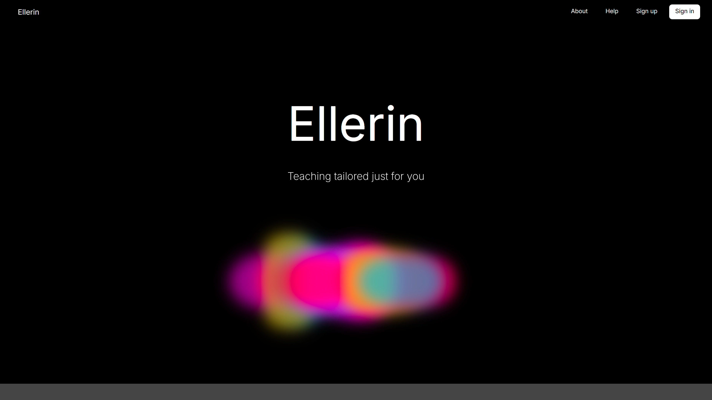
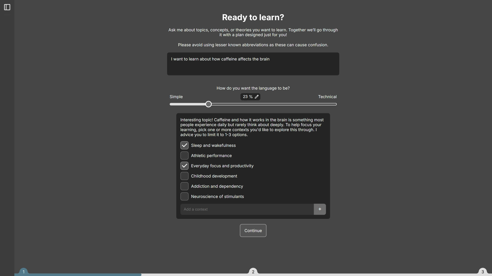
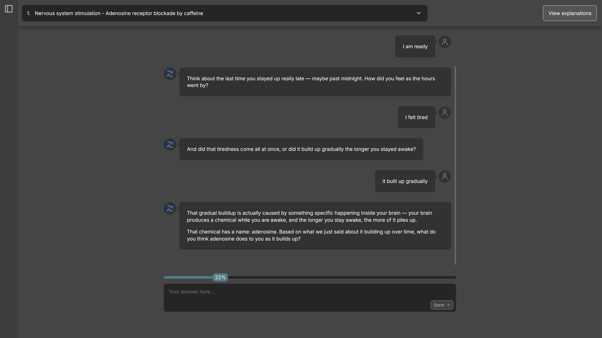
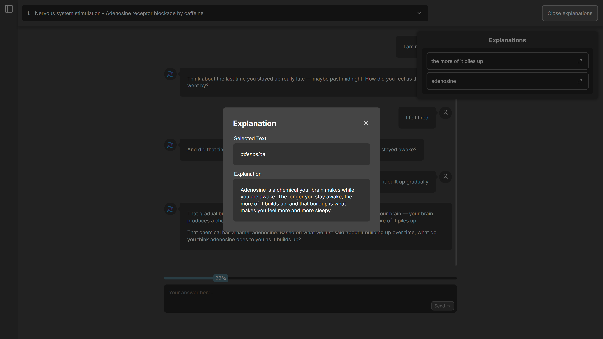
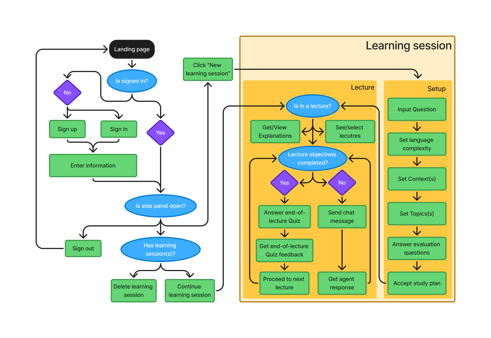

## Om Ellerin
Ellerin is the name of the application we developed as part of our bachelor thesis. The project build upon earlier work done in the In-depth Project course previous semester. That project was a literature study that investigated if use of AI-generated summaries can harm students ability to learn. The study shows that the effect that AI has in learning, largely depends on how the technology is used. We used this study as a baseline in our Bachelors thesis, and chose to develop an AI-powered learning platform. 

The platform works though a network of AI-agents that collaborate to put together a structurized learning plan for students, with a goal of optimizing learning and preventing potential negative cognitive effects of AI use. This happens when the user first goes though a thorough setup process, and gets generated a personal learning plan that the AI-agent will use to take the student though the plan steps. The web application is developed using the MERN-stack.

<strong>Ellerin Landing page</strong>

<strong>Ellerin Setup page</strong>

<strong>Ellerin Lecture page</strong>

<strong>Ellerin Explanation menu</strong>

<strong>Ellerin User Flow diagram</strong>
