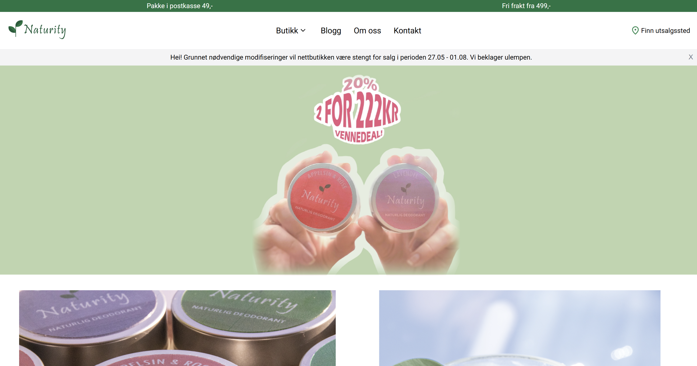
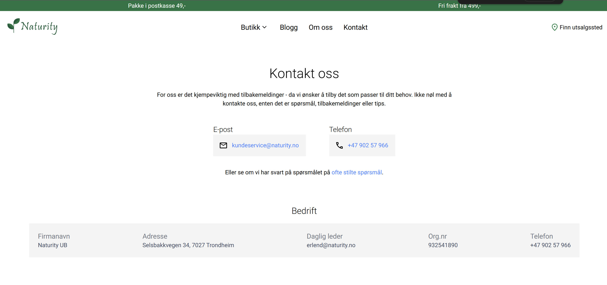
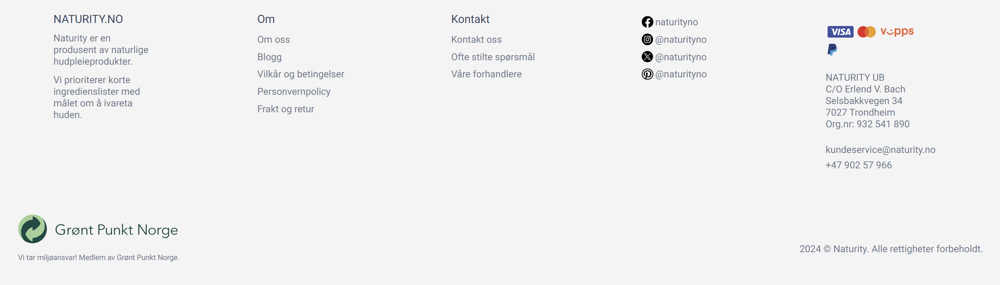

## Om Naturity
Naturity var et selskap som produserte naturlig, håndlaget kosmetikk. Produktene var utelukkende basert på naturlige og økologiske ingredienser, med fokus på at de skulle kunne brukes av personer med sensitiv hud. I starten solgte de kun produktene sine via Etsy, men bestemte seg senere for å opprette en egen, fullstendig uavhengig nettbutikk. De tok kontakt med meg, og i løpet av en toårsperiode hadde jeg ansvaret for å utvikle og drifte nettbutikken og bloggen deres. Nettstedet gjennomgikk to store versjonsendringer: den første ble bygget med Vue.js, og den andre med Next.js.

Nettstedet inneholdt følgende sider:
* Forside
* Produkter side
    * Produktkategori side
    * Produktside (enkeltprodukt)
* Om oss-side
* Bloggoversikt side
    * Blogginnlegg
* Kontaktside
* Forhandlere side

<strong>Naturity Forside</strong>

<strong>Naturity Kontaktside</strong>

<strong>Naturity Bunntekst</strong>
