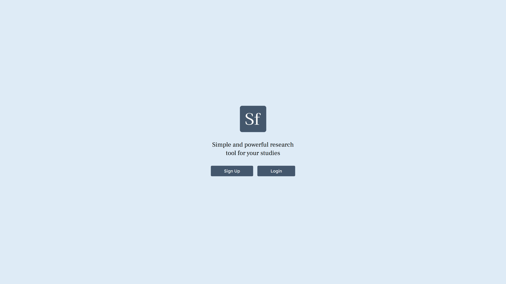
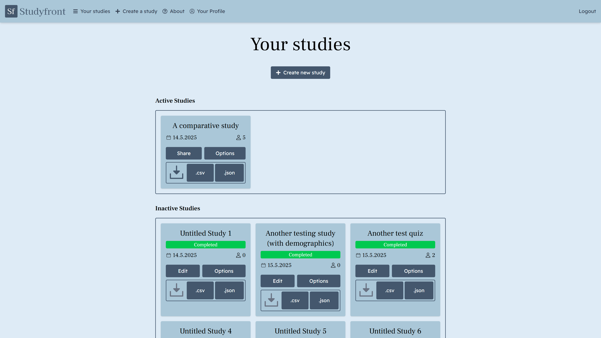
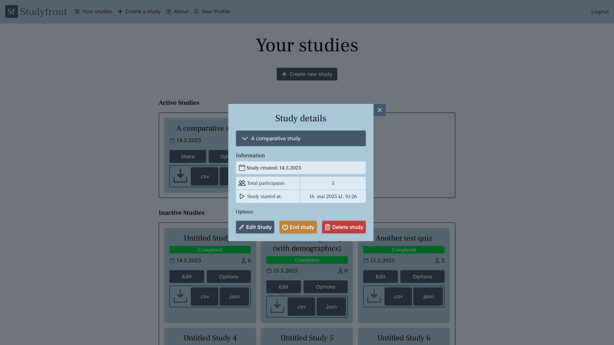
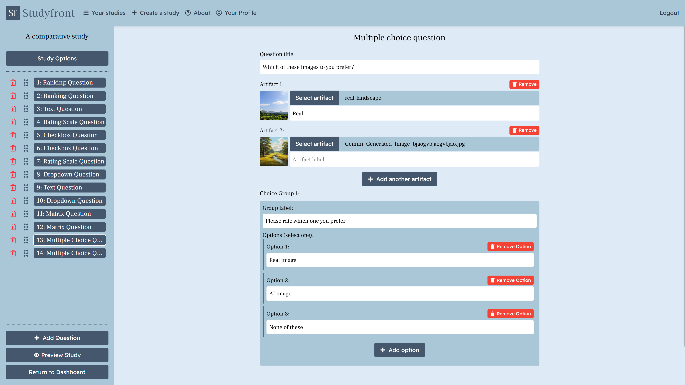
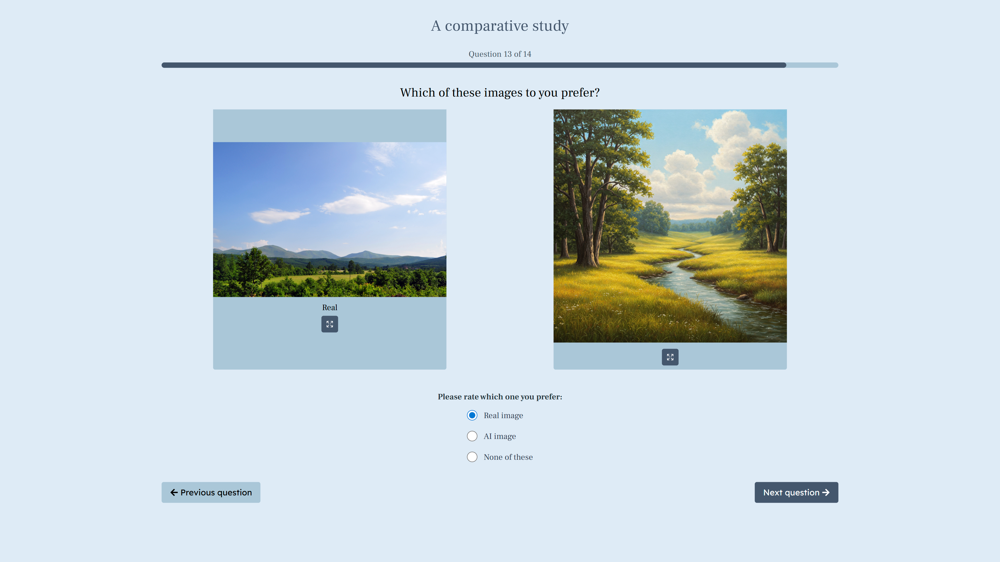

## Om Studyfront
Studyfront er en webapplikasjon som ble utviklet som en del av Webprosjekt emnet våren 2025. Den er laget for å gi forskere et verktøy til å lage og gjennomføre sammenlignings studier.

Den er bygget med Next.js, og har funksjoner som å opprette, starte og fullføre studier. I tillegg kan man innehnte demografisk informasjon om deltageren, og legge til tidsbegrensninger på studiene. Forskeren har valget om å legge til syv forskjellige spørsmåls-komponenter til studien, som vurderingsskala, avkryssingsbokser, flervalg osv. Etter en studie er ferdig gjennomført, har forskerne mulighet til å laste ned resultater av studien som både .csv og .json-filer.

<strong>Studyfront Landingsside</strong>

<strong>Studyfront Dashbordside</strong>

<strong>Studyfront Detaljer om studien</strong>

<strong>Studyfront Opprett studie side</strong>

<strong>Studyfront Gjennomfør studie side</strong>
