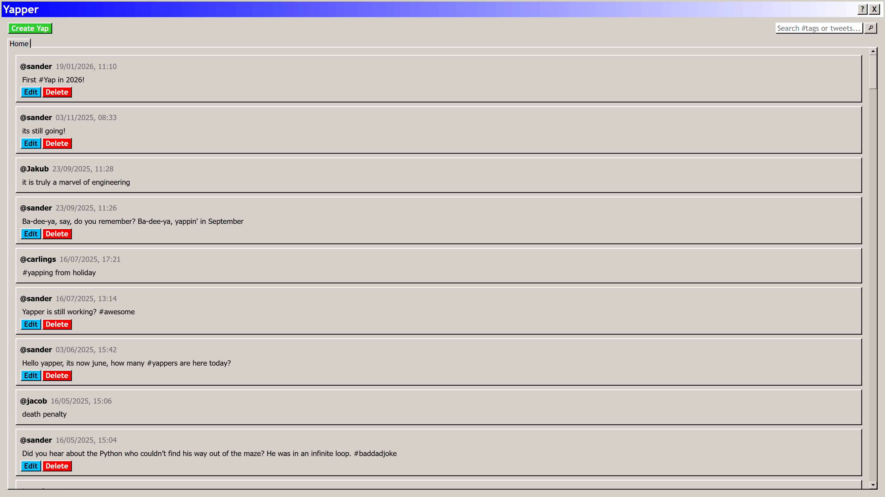
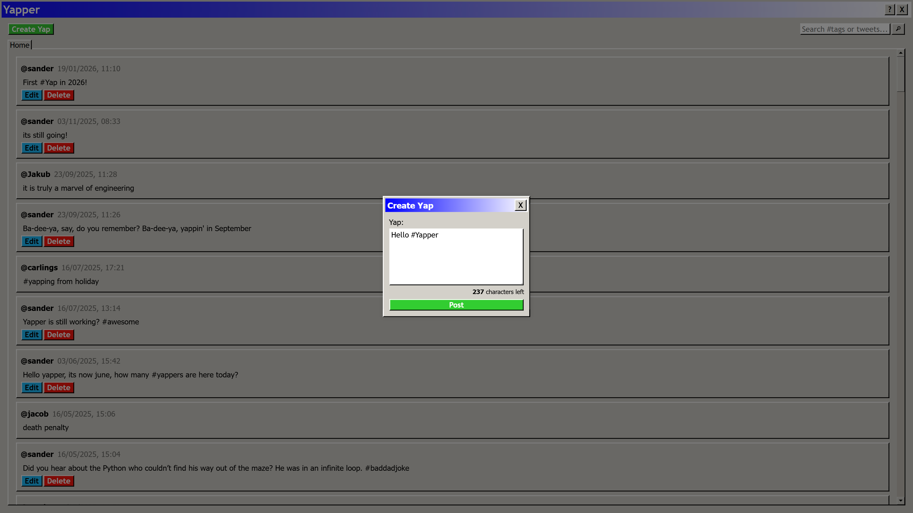
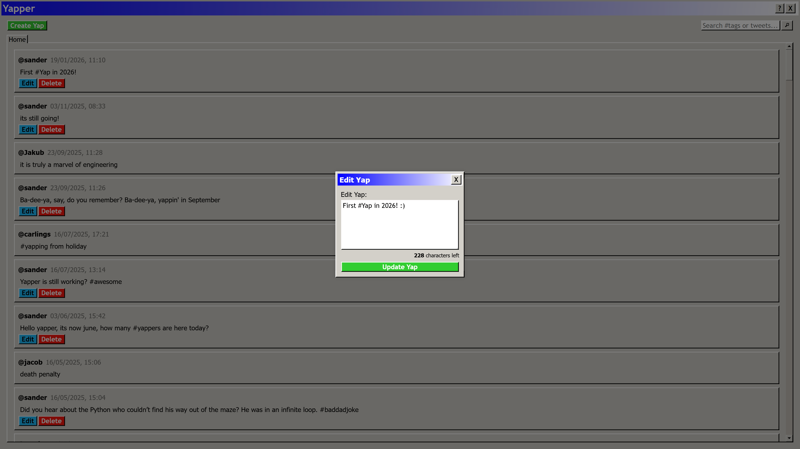

## Om Yapper
Yapper ble utviklet som en del av Skyteknologier emnet våren 2025, hvor oppgaven var å lage en Twitter-kopi. Backend-løsningen ble hovedsakelig bygget med Python, og PostgreSQL ble brukt som databasesystem der brukerdata og "yaps" (poster/tweeter) ble lagret.

Hovedmålet med oppgaven var å lage en applikasjon med stort fokus på avanserte backend teknologier, som lastbalansering (load balancing), mellomlagring (caching) og omvendt proxy (reverse-proxy). Når det gjelder frontenden, kunne vi selv bestemme teknologien vi ville bruke. Da falt valget på React, som vi hadde erfaring med fra tidligere emner. Siden vi hadde stor frihet å designe frontenden som vi ville, valgte vi å style den basert på designet av gamle operativsystemer som Windows 98 og XP. Dette fungerte godt, da applikasjonen ikke hadde så mange funksjoner.

<strong>Yapper Hovedstrøm (main feed)</strong>

<strong>Yapper Opprett yap</strong>

<strong>Yapper Rediger yap</strong>
